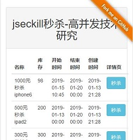
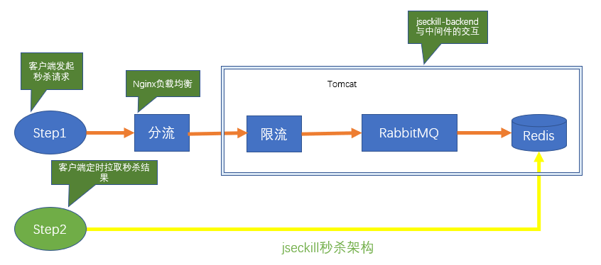
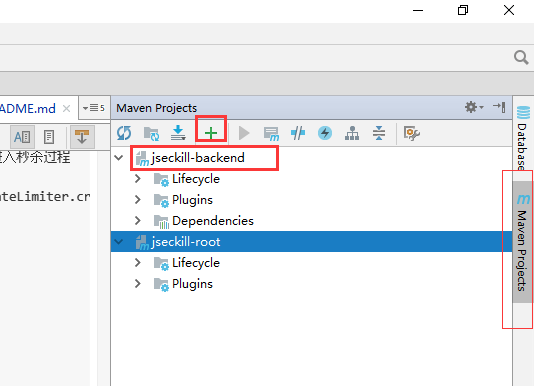

# jseckill


<br/>

| 📘 | 🛫 | 🐱 | 🏛 | 🛒 | 🚀 | 💡 |
| :--------: | :---------: | :------: | :------: | :------: | :------: | :------: |
| [介绍](#介绍) | [演示](#演示) | [技术栈](#技术栈) | [架构图](#架构图) | [秒杀过程](#秒杀过程) | [Quick Start](#QuickStart) | [源码解析](#源码解析) |


| 📌 | ❓ | 🐞 | 🔨 | 💌 |
| :------: | :------: | :------: | :------: | :------: |
| [Todo list](#Todo-list) | [Q&A](#Q-and-A) | [调试排错](#调试排错) | [做贡献](#做贡献) | [联系作者](#联系作者) |
  

## 介绍

<code>jseckill</code>:Java实现的秒杀网站，基于Spring Boot 2.X。 

<code>jseckill</code>:Seckill website implemented with Java, based on Spring Boot 2.X.

**谢谢您对本项目的支持** <br/>
**请点击此处进行**[Star](https://github.com/liushaoming/jseckill/stargazers)


**GitHub** 地址为[https://github.com/liushaoming/jseckill](https://github.com/liushaoming/jseckill)

建议访问GitHub以获取更多分布式项目源码[https://github.com/liushaoming?tab=repositories](https://github.com/liushaoming?tab=repositories)


## 演示
**点击进入演示**：[http://jseckill.appjishu.com](http://jseckill.appjishu.com)

注意：提升输入手机号时，随便输入一个11位的数字即可，**不需要填自己的真实手机号**

效果图

  &nbsp;&nbsp;  
<br/>
<br/>


## 技术栈
- Spring Boot 2.X
- MyBatis
- Redis, MySQL
- Thymeleaf + Bootstrap
- RabbitMQ
- Zookeeper, Apache Curator


## 架构图
部署图
(zookeeper暂时没有用上, 忽略之)
<br/><br/>

<br/>
<br/>

## 秒杀过程
秒杀进行的过程包含两步骤：
步骤一（秒杀）：在Redis里进行秒杀。 这个步骤用户并发量非常大，抢到后，给与30分钟的时间等待用户付款， 如果用户过期未付款，则Redis库存加1
，算用户自动放弃付款。

步骤二（付款）：用户付款成功后，后台把付款记录持久化到MySQL中，这个步骤并发量相对小一点，使用数据库的事务解决数据一致性问题

下面重点讲步骤一，**秒杀**过程

秒杀步骤流程图



1.流程图Step1：先经过Nginx负载均衡和分流

2.进入jseckill程序处理。 Google guava RateLimiter限流。 并发量大的时候，直接舍弃掉部分用户的请求

3.Redis判断是否秒杀过。避免重复秒杀。如果没有秒杀过 <br/>
把用户名（这里是手机号）和seckillId封装成一条消息发送到RabbitMQ，请求变成被顺序串行处理 <br/>
立即返回状态“排队中”到客户端上，客户端上回显示“排队中...” 

4.后台监听RabbitMQ里消息，每次取一条消息，并解析后，请求Redis做库存减1操作（decr命令） <br/>
并手动ACK队列 
如果减库存成功，则在Redis里记录下库存成功的用户手机号userPhone.

5.流程图Step2：客户端排队成功后，定时请求后台查询是否秒杀成功，后面会去查询Redis是否秒杀成功<br/>
如果抢购成功，或者抢购失败则停止定时查询， 如果是排队中，则继续定时查询。

详情见源码文档


## QuickStart
- clone源码

<code>git clone https://github.com/liushaoming/jseckill.git </code>

- 在Intelij IDEA/eclipse里导入根路径下的pom.xml，再导入文件夹jseckill-backend下面的pom.xml, 等待maven依赖下载完毕
详细操作：

**如果是IDEA**，先IDEA | File | Open...，选择jseckill根路径下的pom文件, Open as project以导入根项目jseckill。

操作菜单栏 View | Tool Windows | Maven Projects。 点击"+"， 添加jseckill-backend下面的pom。

此时Maven Projects下面有根项目jseckill和jseckill-backend。如下图



**如果是Eclipse**, import导入maven项目，勾选jseckil和jseckill-backend下面共两个pom文件即可。

- 修改application.properties里面的自己的Redis,MySQL,Zookeeper,RabbitMQ的连接配置

- 右键JseckillBackendApp.java--run as--Java Application

开始Debug

## 源码解析    
👉 [进入源码解析](SOURCE-README.md)
### Java后端限流
使用Google guava的RateLimiter来进行限流 <br/>
例如：每秒钟只允许10个人进入秒杀步骤. (可能是拦截掉90%的用户请求，拦截后直接返回"很遗憾，没抢到") <br/>
AccessLimitServiceImpl.java代码 <br/>
```java
package com.liushaoming.jseckill.backend.service.impl;

import com.google.common.util.concurrent.RateLimiter;
import com.liushaoming.jseckill.backend.service.AccessLimitService;
import org.springframework.stereotype.Service;

/**
 * 秒杀前的限流.
 * 使用了Google guava的RateLimiter
 */
@Service
public class AccessLimitServiceImpl implements AccessLimitService {
    /**
     * 每秒钟只发出10个令牌，拿到令牌的请求才可以进入秒杀过程
     */
    private RateLimiter seckillRateLimiter = RateLimiter.create(10);

    /**
     * 尝试获取令牌
     * @return
     */
    @Override
    public boolean tryAcquireSeckill() {
        return seckillRateLimiter.tryAcquire();
    }
}
```       
👉 [查看更多源码解析](SOURCE-README.md)

## Todo list
- 秒杀成功30分钟订单过期的实现

**方案**:
A:用redis对key设置过期时间，超时的监听
   秒杀成功后订单保存在redis,对key设置过期时间为当时向后推半小时，当key过期后触发监听，对redis库存+1。

- 怎么避免用来削峰的mq中的消息过长，导致mq崩溃

**方案**:
  在进入削峰队列之前，需要判断mq中的消息数目是否过多，如果超过设定的数量限制，直接返回给客户端"已售罄"
  channel.messageCount("seckill") 可以获取到队列中当前到ready的消息的数目
  见接口 [http://localhost:27000/api/rabbitmq](http://localhost:27000/api/rabbitmq)

## Q and A

Q:
为什么有时候会发现消息发送到了队列中，但是不被消费？

A:
一种可能的原因是。 你的电脑上在Debug一个程序jseckill-backend，  另外在你自己的服务器上也运行了同样的程序。
两个程序如果连接的是同一个RabbitMQ，就会同时消费消息，就会发生这样的情况。因为我们在程序员里

<code>com.liushaoming.jseckill.backend.mq.MQConsumer#receive</code>里限制了消费者的个数。
```java
channel.basicQos(0, 1, false);
```

## 调试排错
- 1.java.net.SocketException: Socket Closed--nested exception is com.rabbitmq.client.AuthenticationFailureException: ACCESS_REFUSED

```text
03/10-16:51:28 [main] WARN  org.springframework.boot.web.servlet.context.AnnotationConfigServletWebServerApplicationContext- Exception encountered during context initialization - cancelling refresh attempt: org.springframework.beans.factory.BeanCreationException: Error creating bean with name 'initTask': Injection of resource dependencies failed; nested exception is org.springframework.beans.factory.BeanCreationException: Error creating bean with name 'MQConsumer': Injection of resource dependencies failed; nested exception is org.springframework.beans.factory.UnsatisfiedDependencyException: Error creating bean with name 'seckillServiceImpl': Unsatisfied dependency expressed through field 'mqProducer'; nested exception is org.springframework.beans.factory.UnsatisfiedDependencyException: Error creating bean with name 'MQProducer': Unsatisfied dependency expressed through field 'mqChannelManager'; nested exception is org.springframework.beans.factory.BeanCreationException: Error creating bean with name 'MQChannelManager': Injection of resource dependencies failed; nested exception is org.springframework.beans.factory.BeanCreationException: Error creating bean with name 'mqConnectionSeckill' defined in class path resource [com/liushaoming/jseckill/backend/config/MQConfig.class]: Bean instantiation via factory method failed; nested exception is org.springframework.beans.BeanInstantiationException: Failed to instantiate [com.rabbitmq.client.Connection]: Factory method 'mqConnectionSeckill' threw exception; nested exception is com.rabbitmq.client.AuthenticationFailureException: ACCESS_REFUSED - Login was refused using authentication mechanism PLAIN. For details see the broker logfile.
03/10-16:51:28 [AMQP Connection 47.99.196.243:5672] ERROR com.rabbitmq.client.impl.ForgivingExceptionHandler- An unexpected connection driver error occured
java.net.SocketException: Socket Closed
	at java.net.SocketInputStream.socketRead0(Native Method)
	at java.net.SocketInputStream.socketRead(SocketInputStream.java:116)
	at java.net.SocketInputStream.read(SocketInputStream.java:170)
	at java.net.SocketInputStream.read(SocketInputStream.java:141)
	at java.io.BufferedInputStream.fill(BufferedInputStream.java:246)
	at java.io.BufferedInputStream.read(BufferedInputStream.java:265)
	at java.io.DataInputStream.readUnsignedByte(DataInputStream.java:288)
	at com.rabbitmq.client.impl.Frame.readFrom(Frame.java:91)
	at com.rabbitmq.client.impl.SocketFrameHandler.readFrame(SocketFrameHandler.java:164)
	at com.rabbitmq.client.impl.AMQConnection$MainLoop.run(AMQConnection.java:596)
	at java.lang.Thread.run(Thread.java:745)
03/10-16:51:28 [main] INFO  com.alibaba.druid.pool.DruidDataSource- {dataSource-1} closed
03/10-16:51:28 [main] INFO  org.apache.catalina.core.StandardService- Stopping service [Tomcat]
03/10-16:51:28 [main] INFO  org.springframework.boot.autoconfigure.logging.ConditionEvaluationReportLoggingListener- 

Error starting ApplicationContext. To display the conditions report re-run your application with 'debug' enabled.


```
分析：
这里关键点是<code>nested exception is com.rabbitmq.client.AuthenticationFailureException: ACCESS_REFUSED</code>  <br/>
并且进一步说了<code>- Login was refused using authentication mechanism PLAINM</code>

说明这里是RabbitMQ的用户名和密码认证失败。你需要修改下application-dev.properties里RabbitMQ的用户名和密码相关配置。


- 2.是否需要手动创建队列？
答：不需要手动创建。 程序会自动创建所需要的队列。默认是创建名为"seckill"的队列，待秒杀的请求会先放到这个队列里，后面出队，进入Redis进行秒杀操作。


- 3.ERROR com.rabbitmq.client.impl.ForgivingExceptionHandler- An unexpected connection driver error occured. java.net.SocketException: socket closed
<br/>
rabbitmq.virtual-host配置错误

分析过程：

日志的报错内容跟"用户名密码错误"是一样的。 如果密码已经配置正确了，就可以考虑下面的原因---virtual_host配置错误。

原因，application-dev.properties里面virtual_host默认配置是rabbitmq.virtual-host=/vh_test
如果你改成了"/", 或者其它的值。你需要登陆<code>http://localhost:15672</code>控制台去查看有效的virtual_host是多少。这里必须跟控制台的virtual_host

保持一致

如何在http控制台页面上现实默认的virutal_host=/vh_test, 你这里就配置成rabbitmq.virtual-host=/vh_test
如果是vh_test就配置成rabbitmq.virtual-host=vh_test (左边带不带"/", 是有差别的，这点必须注意)

- 4.rabbitmq.address-list=192.168.20.3:5672,localhost:5672
请注意，这里需要配置的是mq的tcp端口，默认值为5672. 而不是mq的http端口15672

- 5.Redis server服务没有设置密码，怎么配置此项目？
正确的配置是<code>spring.redis.password=</code>
而不是<code>spring.redis.password=''</code> 。切忌在配置里加多余的单引号或者双引号。


## 做贡献
特別鸣谢一下对开源项目作出贡献的开发者

| 序号 | 开发者GitHub | QQ | 邮箱 |
| :-------: | :-------- | :-------: | :-------- |
| 1 | [liushaoming](https://github.com/liushaoming) | 944147540 | [liushaomingdev@163.com](mailto:liushaomingdev@163.com) |


## 联系作者
|  联系方式 |  |
| :-------- | :-------- |
| **Leader** | liushaoming |
| email | [liushaomingdev@163.com](mailto:liushaomingdev@163.com) |
| QQ | 944147540 |


加QQ群讨论 
<br/>


微信公众号


### GitHub

**GitHub**为本人的开源项目主战场，Gitee为从GitHub同步过来的代码。欢迎移步GitHub点击[Star](https://github.com/liushaoming/jseckill/stargazers)并查看本人的更多项目源码

[https://github.com/liushaoming/jseckill](https://github.com/liushaoming/jseckill)

## 福利

### iOS零基础入门教学视频（百度网盘下载，无需密码）

[iOS教学视频](http://pan.baidu.com/share/link?shareid=1745091365&uk=1276224992&qq-pf-to=pcqq.c2c)

大家记得[Star](https://github.com/liushaoming/jseckill/stargazers)此项目来收藏本链接，谢谢！
