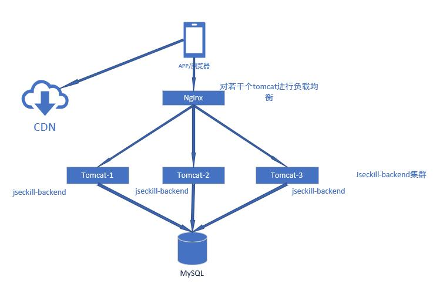

# jseckill源码解析

## 1.总体架构

系统部署图
<br/><br/><br/><br/>

<br/>
<br/>

秒杀网站的静态资源，比如静态网页引用的js，css，图片，音频，视频等放到CDN（内容分发网络）上。<br/>
如果小型互联网公司为了减少成本，可以把静态资源部署到nginx下。利用nginx提供静态资源服务的高并发性能<br/>
的特点，可以最大可能的提高静态资源的访问速度。
<br/>
通过nginx反向代理，对外只暴露80端口。同时配置nginx的负载均衡，为多个jseckill-backend集群节点提供<br/>
负载均衡。 负载均衡策略设置成按照几台应用服务器的性能大小的权重分配就行了。

MySQl部署采用Master-Slave主从复制方式来做读写分离, 提高数据库的高并发能力。

## 2.后端暴露秒杀接口
后端暴露接口的作用是：当秒杀时间开始后，才暴露每个商品的md5，只有拿到md5值，才能形成有效的秒杀请求.<br/>
秒杀时间段结束后，此接口不再返回md5值. <br/>
暴露秒杀接口数据，属于热点数据，并且值是不变的（库存量除外）, 我们把它存在Redis上，Redis是基于内存的
<br/>
非阻塞性多路复用，采用了epool技术，操作数据远远快于磁盘和数据库操作。<br/>
代码见<code>SeckillServiceImpl.java</code>的方法<code>public Exposer exportSeckillUrl(long seckillId)</code>
<br/>
存Redis前，先用Protostuff框架把对Seckill对象序列化成二进制字节码
<br/>

源码<br/>
```java
@Override
    public Exposer exportSeckillUrl(long seckillId) {
        // 优化点:缓存优化:超时的基础上维护一致性
        //1.访问Redis
        Seckill seckill = redisDAO.getSeckill(seckillId);
        if (seckill == null) {
            //2.访问数据库
            seckill = seckillDAO.queryById(seckillId);
            if (seckill == null) {
                return new Exposer(false, seckillId);
            } else {
                //3.存入Redis
                redisDAO.putSeckill(seckill);
            }
        }

        Date startTime = seckill.getStartTime();
        Date endTime = seckill.getEndTime();
        //系统当前时间
        Date nowTime = new Date();
        if (nowTime.getTime() < startTime.getTime()
                || nowTime.getTime() > endTime.getTime()) {
            return new Exposer(false, seckillId, nowTime.getTime(), startTime.getTime(),
                    endTime.getTime());
        }
        //转化特定字符串的过程，不可逆
        String md5 = getMD5(seckillId);
        return new Exposer(true, md5, seckillId);
    }
```

## 3.后端秒杀处理

### 3.1 Java后端限流
使用Google guava的RateLimiter来进行限流 <br/>
例如：每秒钟只允许10个人进入秒杀步骤. (可能是拦截掉90%的用户请求，拦截后直接返回"很遗憾，没抢到") <br/>
AccessLimitServiceImpl.java代码 <br/>
```java
package com.liushaoming.jseckill.backend.service.impl;

import com.google.common.util.concurrent.RateLimiter;
import com.liushaoming.jseckill.backend.service.AccessLimitService;
import org.springframework.stereotype.Service;

/**
 * 秒杀前的限流.
 * 使用了Google guava的RateLimiter
 */
@Service
public class AccessLimitServiceImpl implements AccessLimitService {
    /**
     * 每秒钟只发出10个令牌，拿到令牌的请求才可以进入秒杀过程
     */
    private RateLimiter seckillRateLimiter = RateLimiter.create(10);

    /**
     * 尝试获取令牌
     * @return
     */
    @Override
    public boolean tryAcquireSeckill() {
        return seckillRateLimiter.tryAcquire();
    }
}
```
使用限流, SeckillServiceImpl.java
```java
@Override
@Transactional
/**
 * 执行秒杀
 */
public SeckillExecution executeSeckill(long seckillId, long userPhone, String md5) throws SeckillException {
    if (accessLimitService.tryAcquireSeckill()) {   // 如果没有被限流器限制，则执行秒杀处理
        return updateStock(seckillId, userPhone, md5);
    } else {    //如果被限流器限制，直接抛出访问限制的异常
        logger.info("--->ACCESS_LIMITED-->seckillId={},userPhone={}", seckillId, userPhone);
        throw new SeckillException(SeckillStateEnum.ACCESS_LIMIT);
    }
}
```


### 3.2 减库存

源码见<code>SeckillServiceImpl.java</code>
原理是:<br/>
在<code>public SeckillExecution executeSeckill(long seckillId, long userPhone, String md5)</code><br/>
里，先<code>insertSuccessKilled()</code>，<code>再reduceNumber()</code> <br/>
<b>先插入秒杀记录，再减库存。 这样行锁只作用于减库存一个阶段，提高了操作数据库的并发性能。</b> <br/>
（否则如果先减库存，再插入秒杀记录，则update操作产生的行锁会持续整个事务时间阶段，性能差）
<br/>
源码<br/>
```java
@Override
    @Transactional
    /**
     * 先插入秒杀记录再减库存
     */
    public SeckillExecution executeSeckill(long seckillId, long userPhone, String md5)
            throws SeckillException, RepeatKillException, SeckillCloseException {
        if (md5 == null || !md5.equals(getMD5(seckillId))) {
            logger.info("seckill data rewrite!!!. seckillId={},userPhone={}", seckillId, userPhone);
            throw new SeckillException("seckill data rewrite");
        }
        //执行秒杀逻辑:减库存 + 记录购买行为
        Date nowTime = new Date();

        try {
            //插入秒杀记录(记录购买行为)
            int insertCount = successKilledDAO.insertSuccessKilled(seckillId, userPhone);
            //唯一:seckillId,userPhone
            if (insertCount <= 0) {
                //重复秒杀
                logger.info("seckill repeated. seckillId={},userPhone={}", seckillId, userPhone);
                throw new RepeatKillException("seckill repeated");
            } else {
                //减库存,热点商品竞争
                // reduceNumber是update操作，开启作用在表seckill上的行锁
                int updateCount = seckillDAO.reduceNumber(seckillId, nowTime);
                if (updateCount <= 0) {
                    //没有更新到记录，秒杀结束,rollback
                    throw new SeckillCloseException("seckill is closed");
                } else {
                    //秒杀成功 commit
                    SuccessKilled successKilled = successKilledDAO.queryByIdWithSeckill(seckillId, userPhone);
                    logger.info("seckill SUCCESS->>>. seckillId={},userPhone={}", seckillId, userPhone);
                    //事务结束，关闭作用在表seckill上的行锁
                    return new SeckillExecution(seckillId, SeckillStateEnum.SUCCESS, successKilled);
                }
            }
        } catch (SeckillCloseException e1) {
            throw e1;
        } catch (RepeatKillException e2) {
            throw e2;
        } catch (Exception e) {
            logger.error(e.getMessage(), e);
            //  所有编译期异常 转化为运行期异常
            throw new SeckillException("seckill inner error:" + e.getMessage());
        }
    }
```
<br/>
